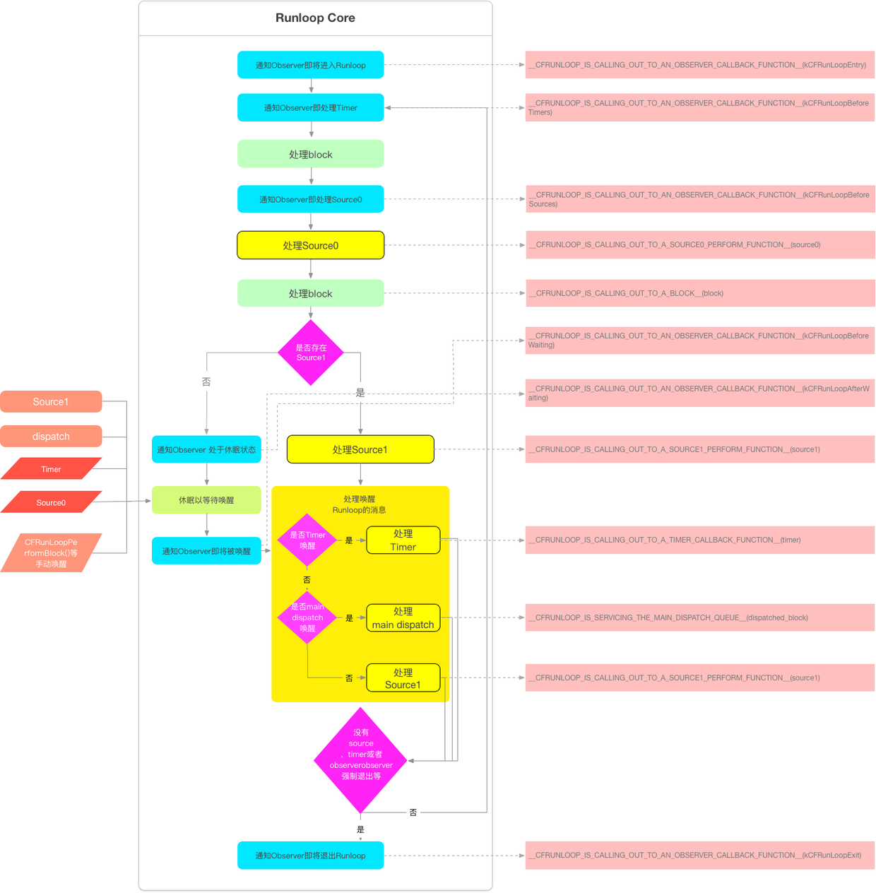

## 什么是 RunLoop？

`RunLoop` 是什么？`RunLoop` 还是比较顾名思义的一个东西，说白了就是一种循环，只不过它这种循环比较高级。一般的 while 循环会导致 CPU 进入忙等待状态，而 `RunLoop` 则是一种“闲”等待，这部分可以类比 Linux 下的 epoll。当没有事件时，`RunLoop` 会进入休眠状态，有事件发生时， `RunLoop` 会去找对应的 Handler 处理事件。`RunLoop` 可以让线程在需要做事的时候忙起来，不需要的话就让线程休眠。

RunLoop 运行流程如下

### Reference

[官方文献](https://developer.apple.com/library/archive/documentation/Cocoa/Conceptual/Multithreading/RunLoopManagement/RunLoopManagement.html#//apple_ref/doc/uid/10000057i-CH16-SW1)

https://juejin.im/post/5aca2b0a6fb9a028d700e1f8#heading-1

