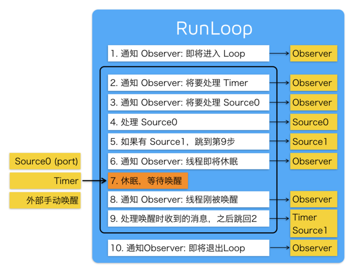

## RunLoop 的内部循环逻辑是怎样的？

- 在 RunLoop 启动之后会发送一个通知，来告知观察者
- 将要处理 Timer/Source 0 事件这样一个通知的发送
- 处理 Source0 事件
- 如果有 Source1 要处理，这时会通过一个 go to 语句的实现来进行代码逻辑的跳转，处理唤醒时收到的消息
- 如果没有 Source1 要处理，线程就将要休眠，同时发送一个通知，告诉观察者
- 然后线程进入一个用户态到内核态的切换，休眠，然后等待唤醒，唤醒的条件大约包括三种：
  - Source 0
  - Timer
  - 外部手动唤醒
- 线程刚被唤醒之后也要发送一个通知告诉观察者，然后处理唤醒时收到的消息
- 回到将要处理 Timer/Source 0 事件这样一个通知的发送
- 然后再次进行上面步骤，这就是一个 RunLoop 的事件循环机制

### Reference

https://www.jianshu.com/p/7db5b2775623