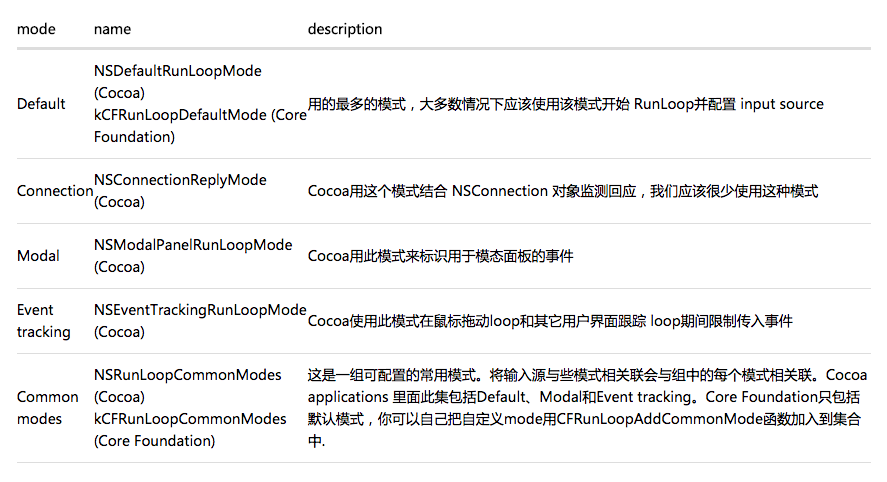

## RunLoop 有哪几种 mode？对常见 mode 的理解？

RunLoop 一共有 5 种 mode。

iOS 中暴露出来的有 3 个 mode：

- default：默认情况下的 mode。
- tracking：当 `UIScrollView` 滑动的时候会切换到 tracking mode。
- common：会将事件分别注册到 default 和 tracking mode 中。

### Reference

https://juejin.im/post/5aca2b0a6fb9a028d700e1f8#heading-3