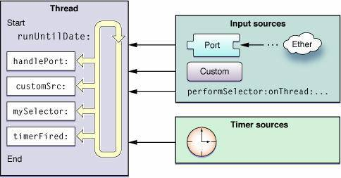

## RunLoop 和线程有什么关系？

1. 每条线程都有唯一的一个与之对应的 RunLoop 对象。
2. 主线程的 RunLoop 已经自动创建好了，子线程的 RunLoop 需要主动创建。
3. RunLoop 在第一次获取时创建，在线程结束时销毁。

RunLoop 与线程的关系如下图：

> 图中展现了 Runloop 在线程中的作用：从 input source 和 timer source 接受事件，然后在线程中处理事件。

### Reference

https://juejin.im/post/5aca2b0a6fb9a028d700e1f8#heading-2

https://imlifengfeng.github.io/article/487/