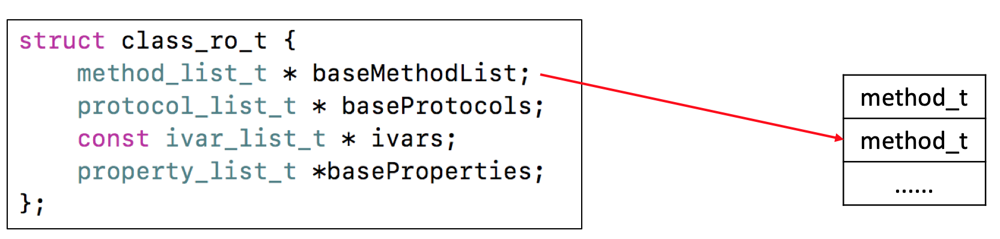
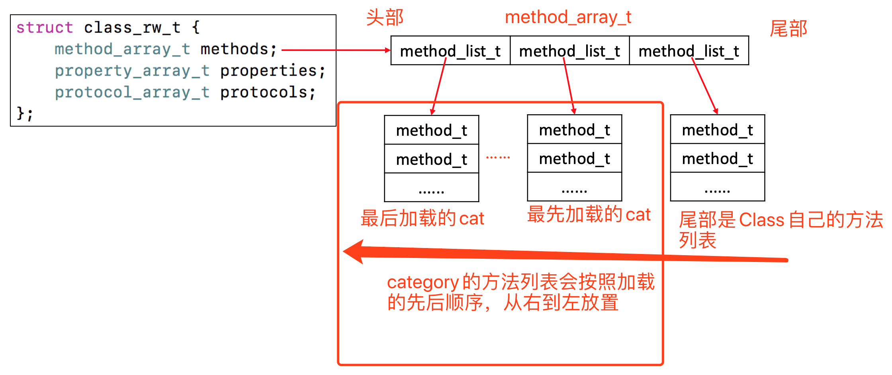
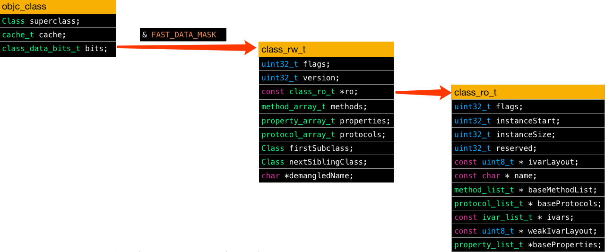

## Runtime 基础数据结构有哪些？

```objective-c
typedef struct objc_class *Class;
typedef struct objc_object *id;
```

### objc_object

```objective-c
/// 对象 - 64 位之前的结构
struct objc_object {
    Class isa; // isa 直接指向 objc_class
};

/// 对象 - 64 位之后的结构
struct objc_object {
private:
    isa_t isa;
};
```


### objc_class

```objective-c
/// 类
struct objc_class : objc_object {
    Class isa;
    Class superclass;       // 用于获取父类，也就是元类对象，它也是一个 Class 类型
    cache_t cache;          // 方法缓存
    class_data_bits_t bits; // 用于获取具体的类信息

    class_rw_t *data() { 
        return bits.data();
    }
    void setData(class_rw_t *newData) {
        bits.setData(newData);
    }
};
```


### class_rw_t & class_ro_t

紧接着有一个 `class_rw_t *data()` 函数，该函数的作用就是获取该类的**可读写信息**，通过 `class_data_bits_t` 的 `bits.data()` 方法获得，点进该方法看一下。

```objective-c
class_rw_t* data() {
    return (class_rw_t *)(bits & FAST_DATA_MASK);
}
```

这里是将类对象里面的`class_data_bits_t bits;`和一个`FAST_DATA_MASK`进行`&`运算取得。返回的是一个指针，类型为`class_rw_t *`，查看该类型的源码如下。

```objective-c
struct class_rw_t {
    uint32_t flags;
    uint32_t version;

    const class_ro_t *ro;
		
  	// 通过 Category 添加的方法会放到 methods 中
    method_array_t methods;        // 方法列表
    property_array_t properties;   // 属性列表
    protocol_array_t protocols;    // 协议列表

    Class firstSubclass;
    Class nextSiblingClass;

    char *demangledName;
}
```

```objective-c
struct class_ro_t {
    uint32_t flags;
    uint32_t instanceStart;
    uint32_t instanceSize; // instance 对象占用的内存空间
#ifdef __LP64__
    uint32_t reserved;
#endif

    const uint8_t * ivarLayout;
    
    const char * name;               // 类名
    method_list_t * baseMethodList;  // 方法列表
    protocol_list_t * baseProtocols; // 协议列表
    const ivar_list_t * ivars;       // 成员变量列表

    const uint8_t * weakIvarLayout;
    property_list_t *baseProperties; // 属性列表

    method_list_t *baseMethods() const {
        return baseMethodList;
    }
};
```

实际上，`class_ro_t` 代表 Class 的只读信息，也就是 Class 本身的固有信息，再直接一点就是是写在它的 @interface 和 @end 之间的方法，属性，等信息，当然最重要的作用还是存放类的成员变量信息 ivars，而且是被 const 修饰说明是不可修改的，这也就是为什么 Runtime 无法动态增加成员变量，底层结构决定的。我个人将这部分理解成OC的静态信息。`class_ro_t` 中的 `method_list_t * baseMethodList;`，是一个一维数组，里面装的就是这个 Class 本身的方法。



在有了 `class_rw_t` 之后，便会进行 category 的处理，将 Class 本身的方法列表和 category 里面的方法列表先后放到 `class_rw_t` 的 `method_array_t methods` 里面，Class 自身的方法列表会被最先放入其中，并且置于列表的尾部，category 方法列表的加入顺序等同与 category 文件参与编译的顺序，这部分流程的详细说明在[Objective-C之Category的底层实现原理](https://www.jianshu.com/p/6d20c40cb06e)一文里有详细介绍。因此，`method_array_t methods;` 是一个二维数组。



上面 3 个类总结如图：



这个图可以理解成稳定状态下，Class 的内部结构。但事实上，在程序启动和初始化过程中，Class 并不是这样的结构，具体过程见这篇[文章](https://www.jianshu.com/p/af2d806a9d61)，这里不展开了。


### method_t

上面我们剖析了 `class_rw_t`、`class_ro_t `这两个重要部分的结构，并且主要关注了其中的方法列表部分，而从上面的分析，可发现里面最基本也是重要的单位是 `method_t`，这个结构体包含了描述一个方法所需要的各种信息。

```objective-c
struct method_t {
    SEL name;          // 方法选择器
    const char *types; // 函数类型编码
    IMP imp;           // 指向函数的指针
};
```

这 3 个属性也不展开了，具体看这篇[文章](https://www.jianshu.com/p/af2d806a9d61)。


### cache_t

在 `objc_class` 类中有 `cache_t` 这个属性，顾名思义这就是用来缓存方法的。它的底层是通散列表（哈希表）的数据结构来实现的，用于缓存曾经调用过的方法，可以提高方法的查找速度。正常情况下方法调用的流程如下：

- `obj` -> `isa` -> `obj` 的 `Class` 对象 -> `method_array_t methods` -> 对该表进行遍历查找，找到就调用，没找到继续往下走
- `obj` -> `superclass` -> `obj`的父类 -> `isa` -> `method_array_t methods` -> 对父类的方法列表进行遍历查找，找到就调用，没找到就重复本步骤
- 找到就调用，没找到重复流程
- 找到就调用，没找到重复流程
- 找到就调用，没找到重复流程
- 直到 `NSObject` -> `isa` -> `NSObject` 的 `Class` 对象 -> `method_array_t methods`

如果某个方法在程序内会被频繁的调用，那么这种逐层便利查找的方式肯定是效率低下的，因此苹果设计了 `cache_t cache`，当某个第一次被调用的时候，会按照常规流程查找，找到之后，就会被加入到 `cache_t cache` 中，当再次被调用的时候，系统就会直接现到 `cache_t cache` 来查找，找到就直接调用，这样便大大提升了查找的效率。

```objective-c
struct cache_t {
    struct bucket_t *_buckets; // 用来缓存方法的散列/哈希表
    mask_t _mask;              // 这个值 = 散列表长度 - 1
    mask_t _occupied;          // 表示已经缓存的方法的数量
}
```

```objective-c
struct bucket_t {
private:
    cache_key_t _key; // 方法的 SEL，也就是方法名
    IMP _imp;         // 方法对应的函数的内存地址
}
```

关于缓存还有很多知识点，比如如何处理哈希碰撞，什么时候扩容等，具体看这篇[文章](https://www.jianshu.com/p/a1a91d91641b)


### Reference

[Runtime 源码](https://github.com/opensource-apple/objc4)

https://www.jianshu.com/p/30de582dbeb7 【建议阅读】

https://www.jianshu.com/p/af2d806a9d61

https://www.jianshu.com/p/a1a91d91641b