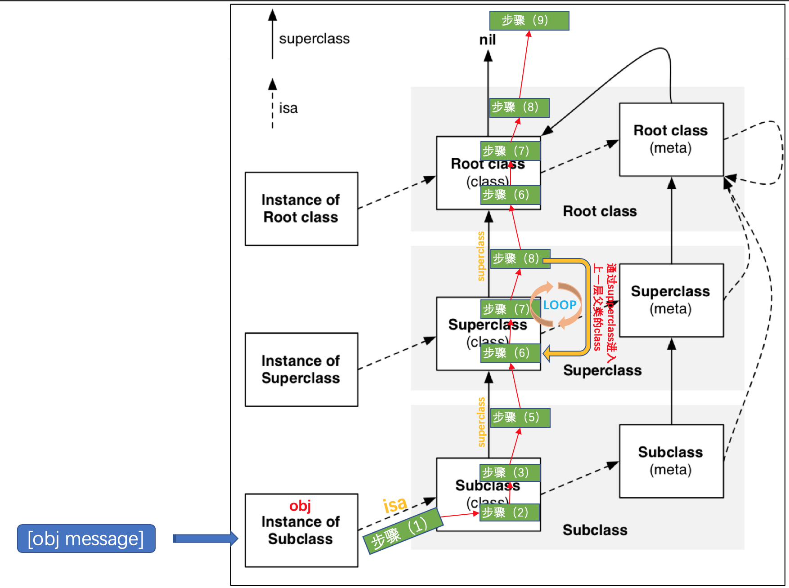

## 消息发送的过程是怎样的？

1. 当一个对象接收到消息时 `[obj message];`，首先根据 `obj` 的 `isa` 指针进入它的类对象 `cls` 里面。
2. 在 `obj` 的 `cls` 里面，首先到缓存 `cache_t` 里面查询方法 `message` 的函数实现，如果找到，就直接调用该函数。
3. 如果上一步没有找到对应函数，在对该 `cls` 的方法列表进行二分/遍历查找，如果找到了对应函数，首先会将该方法缓存到 `obj` 的类对象 `cls` 的 `cache_t` 里面，然后对函数进行调用。
4. **在每次进行缓存操作之前，首先需要检查缓存容量，如果缓存内的方法数量超过规定的临界值(设定容量的 3/4)，需要先对缓存进行 2 倍扩容，原先缓存过的方法全部丢弃，然后将当前方法存入扩容后的新缓存内。**
5. 如果在 `obj` 的 `cls` 对象里面，发现缓存和方法列表都找不到 `mssage` 方法，则通过 `cls` 的 `superclass` 指针进入它的父类对象 `f_cls` 里面。
6. 进入 `f_cls` 后，首先在它的 `cache_t` 里面查找 `mssage`，如果找到了该方法，那么会首先将方法缓存到**消息接受者 **`obj` 的类对象 `cls` 的 `cache_t` 里面，然后调用方法对应的函数。
7. 如果上一步没有找到方法，将会对 `f_cls` 的方法列表进行遍历二分/遍历查找，如果找到了 `mssage` 方法，那么同样，会首先将方法缓存到**消息接受者 **`obj` 的类对象 `cls` 的 `cache_t` 里面，然后调用方法对应的函数。**需要注意的是，这里并不会将方法缓存到当前父类对象 f_cls 的 cache_t 里面。**
8. 如果还没找到方法，则会通过 `f_cls` 的 `superclass` 进入更上层的父类对象里面，按照 `(6)->(7)->(8)` 步骤流程重复。如果此时已经到了基类对象 `NSObject`，仍没有找到 `mssage`，则进入步骤 `(9)`。
9. 接下来将会转到消息机制的**动态方法解析**阶段

### Reference

https://www.jianshu.com/p/198f031f44ea