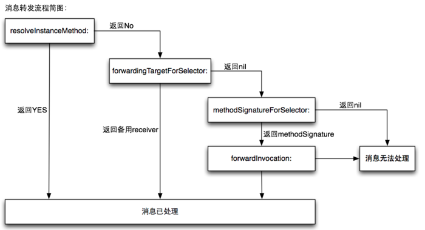

## 消息转发的过程是怎样的？

1. `+resolveInstanceMethod:` 或 `+resolveClassMethod:`，是动态方法解析，让你有机会提供一个函数实现。
2. `-(id)forwardingTargetForSelector:(SEL)aSelector` 会看类有没有实现这个方法，这个方法返回的是一个 `id` 类型的转发对象 `forwardingTarget`，如果其不为空，则会通过 `objc_msgSend` 函数对其直接发送消息 `objc_msgSend(forwardingTarget, sel, ...);`，也就是说让转发对象 `forwardingTarget` 去处理当前的方法 SEL。如果 `forwardingTarget` 为 `nil`，则进入下面的方法。
3. `-(NSMethodSignature *)methodSignatureForSelector:(SEL)aSelector` 这个方法是让我们根据方法选择器 SEL 生成一个 `NSMethodSignature` 方法签名并返回，这个方法签名会生成一个 `NSInvocation`，将其作为参数，调用 `- (void)forwardInvocation:(NSInvocation *)anInvocation` 方法。如果我们在这里没有返回方法签名，系统则认为我们彻底不想处理这个方法了，就会调用 `doesNotRecognizeSelector:` 方法抛出经典的报错报错 `unrecognized selector sent to instance 0xXXXXXXXX`，结束消息机制的全部流程。

### Reference

https://www.jianshu.com/p/198f031f44ea

https://www.jianshu.com/p/45db86af7b60