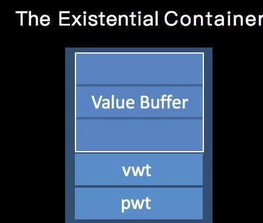
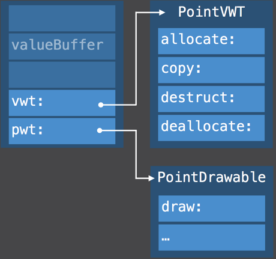
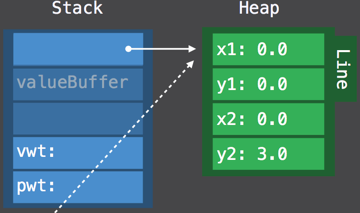

## 协议的内存布局？协议的属性存储在什么地方？VWT 是什么？PWT 又是什么？

首先考虑一个问题，现在有两个 `struct` 都遵守了一个协议。但是两个 `struct` 内的元素数量不同，这会导致两个 `struct` 的内存大小不一致。如果把两个 `struct` 的实例放到数组中，这会是个灾难，将无法定位数组内元素的位置。

```swift
protocol Drawable {
    func draw()
}
struct Point : Drawable {
    var x, y: Double
    func draw() { ... }
}
struct Line : Drawable {
    var x1, y1, x2, y2: Double
    func draw() { ... }
}

let a: Drawable = Point()
let b: Drawable = Line()
let drawables : [Drawable] = [a, b]
```


为了解决上述问题，Swift 引入一个叫做 `Existential Container` 的数据结构。思路是：使用一个额外的容器（Container）来放每个带有协议的值类型，而数组里面放的是一个固定大小的容器。





前三个 word 是 Value buffer，用于存放元素的值，如果 word 数大于 3，则采用指针的方式，在堆上分配对应需要大小的内存。

第四个 word：Value Witness Table (VWT)。每个类型都对应这样一个表，用来存储值的创建，释放，拷贝等操作函数。(管理 Existential Container 生命周期)

第五个 word：Protocol Witness Table (PWT)，用于存放协议（Protocol）对应的函数的实现函数地址。

如果待存放的实例对象大于 3 个 world，Swift就会在堆内存中申请一块空间，将该值保存在堆内存中，堆内存的对应的地址就会保存在 Value Buffer 的第 1 个 word 中。就像下图这样。



最终，这种设计使得：

- 数组中每个元素的大小都是固定的 5 个 word，解决了数组元素下标快速定位的问题。
- 因为有 Value Buffer 的存在，我们可以将不同大小的值类型存放到 Value Buffer 中，小于等于 3 个 word 的值直接存储，更大的则通过保存引用地址的方式存储。
- 通过 Value Witness Table，我们可以找到这个值类型的相关生命周期的管理函数。
- 通过 Protocol Witness Table，我们可以找到协议的具体实现函数的地址。


### Reference

https://www.jianshu.com/p/0ca59322c08b